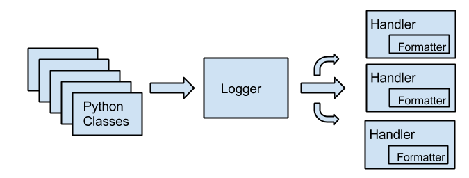

* Goal: Get python apps to output logstash compatible log files.
* Audience: Folks who have python apps and want an easy path to logstash

# preface: python logging

Python logging is organised around a few key concepts:

* _loggers_ are sink for logs
* _handlers_ are storage endpoints for loggers
* _formatters_ generate the actual payload to store in handlers

The logging path could be represented this way:

# the proposed architecture

In this document will push towards letting standard python handlers store
the logs, as opposed to talking directly to elasticsearch, redis, or zmq as
this might be too particular for some use cases.

The alternative proposed is to use a log formatter which outputs in a format
meant to be directly consumable by the `json` format in logstash.

On the logstash side a simple file input and `json` format will then be 
sufficient.

# python setup

A pip package is available for formatting logs correctly: `logstash_formatter`,
available here: https://github.com/exoscale/python-logstash-formatter, other
dependencies are provided by python itself.

First step in your application will be to create an appropriate logger,
for instance the following code will create a logger ready to output to a file:

    import logging
    import logstash_formatter
    
    logger = logging.getLogger()
    handler = logging.FileHandler('/var/log/myapp.log')
    formatter = logstash_formatter.LogstashFormatter()
    
    handler.setFormatter(formatter)
    logger.addHandler(handler)

# logstash setup

Provided the above logger is used to output messages, the following
logstash input can be used to gather messages in logstash:

    file {
      sincedb_path => "/var/lib/logstash/sincedb"
      format       => "json_event"
      type         => "myapp"
      path         => [ "/var/log/myapp.log" ]
    }
